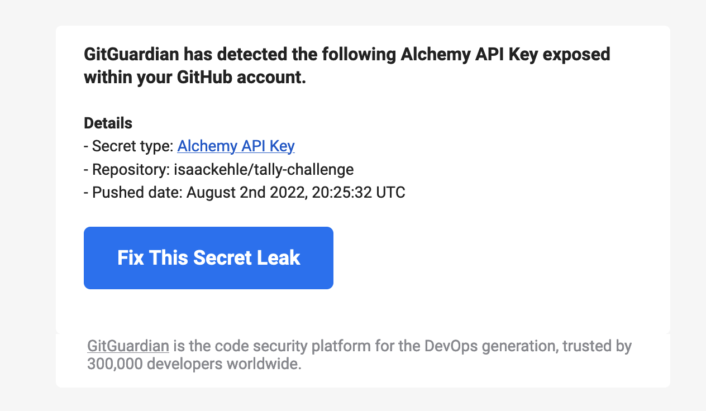

# Change Log/Notes

## Step 1

- Ensure that local packages install cleanly
- Add this changelog

## Step 2

- `npm install --save siwe ethers`
- Added types/index.ts to give typing to `window.ethereum`

## Step 3

- creating nonce through web browser (no longer using the sample code from siwe)
- disabled button for verify

## Step 4

- remove default unused content
- style buttons w/ the good ole bootstrap library

## Step 5

- added react-icons for font awesome awesomeness
- could have used react table for the transactions but left them as components
- could have created a template for the transactions vs title bar
- For reference: <https://css-tricks.com/snippets/css/a-guide-to-flexbox/#flexbox-background>
- Filled out basic layout

## Step 6

- helper function for icon selection

## Step 7

- Move to a singleton for ethereum messages
- could create a folder for react components
- other cleanup of unused inputs and code

## Step 8

- I took a quick stab at trying to include .env into the frontend with the [dotenv](https://www.npmjs.com/package/dotenv) package. This is obviously something that would be secured. For now, hardcoding.

## Step 9

- woot for protections

## Step 10

- converted the form to an array of text inputs, with `React.Fragment`.
- validated form data is pulled

## Step 11

- Signing a message

## Step 12

- fixed issue with alchemy package
- added functions to query alchemy to Get the token balances and metadata for the tokens
